  

  

  
  
  
  

## the short version

i'm **volodymyr**, a cs student at **san josé state**. i like shipping things that feel slightly illegal for the amount of time they took.

two drawers. that's the whole filing system:

| | |
| :---: | :---: |
| **[⚡ hackathons](https://github.com/hellowworld-ctrl/hackathons)** | **[🎓 school](https://github.com/hellowworld-ctrl/school)** |
| sleep is a suggestion | sjsu, studios, ten-day crises |
| BrainWave · Momentum · Pantri · Helix · Crush-Depth | Wild Ride · Canvas-Ultra |

<b>▶ press start — what's actually in here</b>

 

### hackathon cabinet
weekend products. prizes optional. shipping mandatory.

| build | one-liner | portal |
| :--- | :--- | :---: |
| **BrainWave AI** | voice-first copilot that plans the video, unsticks the edit, and reads the audience after | [devpost](https://devpost.com/software/brainwave-ai) · [folder](https://github.com/hellowworld-ctrl/hackathons/tree/main/brainwave-ai) |
| **Momentum.AI** | the doctor's visit becomes a private health memory — summaries, follow-ups, paperwork | [devpost](https://devpost.com/software/momentum-ai) · [folder](https://github.com/hellowworld-ctrl/hackathons/tree/main/momentum-ai) |
| **Pantri** | live food-bank hours + restaurant surplus. a meal that exists *today*, not a pdf from 2019 | [devpost](https://devpost.com/software/pantri-rxsu1v) · [folder](https://github.com/hellowworld-ctrl/hackathons/tree/main/pantri) |
| **Helix** | compression / reconstruction experiments for images and ai pipelines | [folder](https://github.com/hellowworld-ctrl/hackathons/tree/main/helix) |
| **Crush-Depth** | the deep-dive slot on the personal-site roster | [folder](https://github.com/hellowworld-ctrl/hackathons/tree/main/crush-depth) |

### school locker
classwork that grew a personality.

| build | one-liner | portal |
| :--- | :--- | :---: |
| **Wild Ride** | 10-day rpg. you are john mcafee. belize goes sideways. miami is the extract. we called it gold. | [repo](https://github.com/hellowworld-ctrl/John-McAfrees-Wild-Ride-Third-Week-Anniversary-Edition-Collectors-Edition) · [folder](https://github.com/hellowworld-ctrl/school/tree/main/wild-ride) |
| **Canvas-Ultra** | canvas, but less miserable. kept at its current visibility on purpose. | [folder](https://github.com/hellowworld-ctrl/school/tree/main/canvas-ultra) |

  

  <code>c++</code>
  &nbsp;·&nbsp;
  <code>typescript</code>
  &nbsp;·&nbsp;
  <code>react</code>
  &nbsp;·&nbsp;
  <code>python</code>
  &nbsp;·&nbsp;
  <code>google cloud</code>
  &nbsp;·&nbsp;
  <code>elevenlabs</code>
  &nbsp;·&nbsp;
  <code>too many .wav files</code>

  
  

  

  

  <picture>
    <source media="(prefers-color-scheme: dark)" srcset="https://raw.githubusercontent.com/hellowworld-ctrl/hellowworld-ctrl/output/github-contribution-grid-snake-dark.svg"/>
    <source media="(prefers-color-scheme: light)" srcset="https://raw.githubusercontent.com/hellowworld-ctrl/hellowworld-ctrl/output/github-contribution-grid-snake.svg"/>
    
  </picture>

if the snake is missing, open Actions on the profile repo and run <b>generate animation</b> once.

